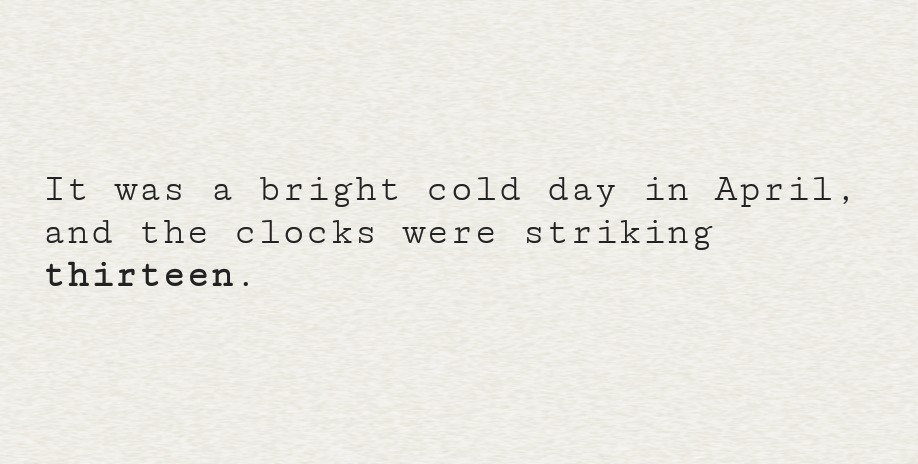
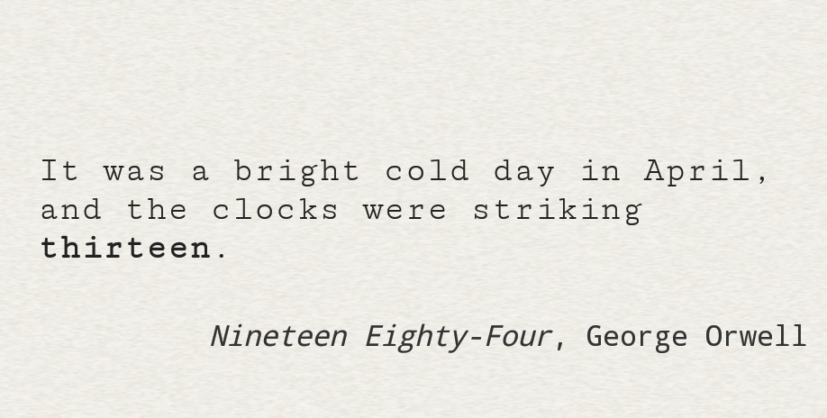
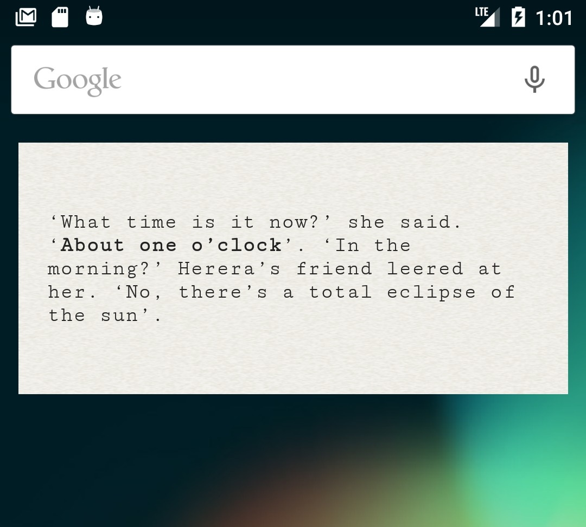
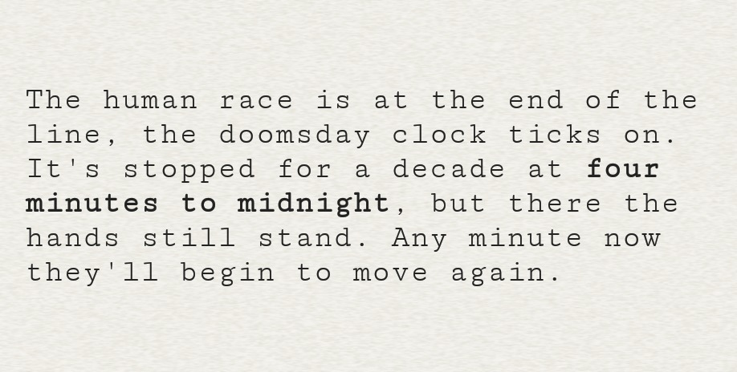

# ProseZeit - Literary Clock Widget for Android

Inspired by (i.e. completely knocked off from) [tjaap](https://www.instructables.com/member/tjaap/)'s [Literary Clock made from a Kindle](https://www.instructables.com/id/Literary-Clock-Made-From-E-reader/) (and [obvious shameless plug](https://hackaday.com/2018/08/01/kindle-tells-the-time-by-quoting-literature/)), *ProseZeit* is an Android widget (the ones you can put on your home screen) that does the exact same thing: display the current time by quoting literature.

And just like the original, the trivia quiz option is added by leaving away the quote's origin, and only reveal the book title and author when clicking on the widget.

Major credit goes of course to tjaap for publicly providing his quote collection as CSV file, which serves as main source for this project.

## Getting the quotes in the app

The simplest solution seemed to convert the CSV file into a SQLite database that can be shipped with the Android widget app. A simple Python script (like, seriously simple, as in "this is the bare minimum I need") takes care of that, and can be found in the `tools/` directory, along with the CSV file as input. I took the liberty and fixed a few inconsistencies and cosmetic issues in tjaap's original CSV file -- case sensitivity in pattern and quote didn't match in some cases, and some extra whitespace at the end of the quote, author or book title.

This is more of a FYI though, if you want to just compile and run the app, there's no need to use that script, there is already a readily converted SQLite database file in the app's assets folder. But in case you don't like the highlighting of the actual time, you can adjust that in the Python script and re-generate the SQLite database (and copy it to the app's assets directory)

## Compiling and running the app

The Android code is a normal Android Studio project and can be imported there accordingly.

Note, you may get some "Default Activity not found" error when trying to run the app from within Android Studio, edit the run configuration (*Run* -> *Edit Configurations...*) and change the *Launch Options* from "Default Activity" to "Nothing".

Since ProseZeit is just a widget, there won't be any actual app installed. To open the widget, long press on the home screen, which should open some menu to select "Widgets" from. Scroll through the list of available widgets until you find ProseZeit. Drag it to your home screen, and tadaa, you know the time.

## Just running the app

The widget is available for open beta testing on the Google Play store.

While I don't have any real intentions to turn this project into an actual, serious, fully functioning clock widget (see *Known issues* below), I figured it might still be useful to get it easy enough available, in case anyone is curious. I mean, sure, you can build and install it yourself with Android Studio, but that's not everyone's cup of tea.

### Join the open beta testing
I used this opportunity to have a look at the open beta testing. Not fully sure if there's much of a point, considering I'm currently not planning any further development. But I guess it allows to leave feedback or I don't know. Well, [feel free to join](https://play.google.com/apps/testing/fi.craplab.prosezeit) for shits and giggles ¯\\\_(ツ)\_/¯

# Known issues

Consider this project as a proof of concept rather than a seriously well developed app. This was so far only tested with the Android Studio emulator running Android 6.0 (I should probably update that) and one actual Android 8.0 device. It kinda worked with a few quirks.

* **Widget shows only "Couldn't add widget" after adding it to a home screen**
  * Somehow related to the click listener on the widget -- at least removing the `setOnClickPendingIntent()` call made it work for me:tm:
  * Removing the widget again from the home screen and adding it again may "fix" it (just remove the widget, not the whole app)
* **Time update isn't accurate on the minute**
  * Yeah, unless I missed something major, this is just how it is..
  * The update timer probably drifts also quite a bit, delaying the update even more. There could be some automatic correction put in place, but then again, this is more a proof a concept, and other excuses
* **Database is loaded again every time the time changes**
  * I'm just gonna blame the widget life cycle here - which I obviously haven't fully figured out yet. I guess?
* **Text doesn't fit / needs too much space / looks like crap / ...**
  * Again, proof of concept. But also, some of the limitations that come with the widget environment didn't leave me too happy with the general situation of this project to pursue a more user-friendly path. There could be some config activity attached to set colors, fonts and background or so, sure.
